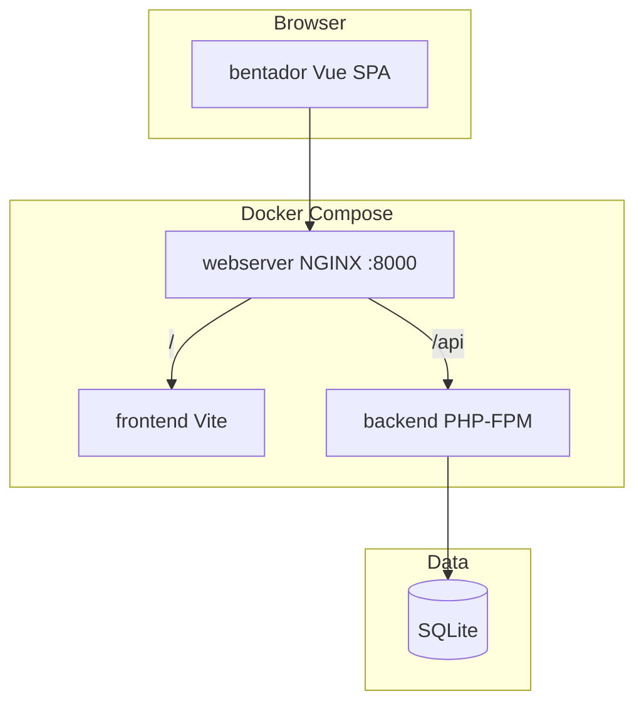

# ARCHITECTURE.md — Benta Door System Design

High-level architecture for the FYB Tech Exam monorepo.

---

## System diagram



In development, the browser may also talk to `http://localhost:8000` directly (axios `baseURL` in dev).

---

## Monorepo layout

| Directory | Role |
|-----------|------|
| `backend/` | Laravel 12 REST API |
| `bentador/` | Vue 3 admin + order-entry SPA (git submodule) |
| `frontend/` | Legacy/alternate Vue app (forums); not wired in root `docker-compose` |
| `docker-compose.yml` | `backend`, `frontend` (bentador), `webserver` |
| `init.sh` | First-time Docker bootstrap |

---

## Backend architecture

### Stack

- PHP 8.2+, Laravel 12
- JWT auth: `php-open-source-saver/jwt-auth` (guard `api`)
- RBAC: `spatie/laravel-permission`
- PDF export: `barryvdh/laravel-dompdf`
- Tests: Pest / PHPUnit

### Layering

```
routes/api.php
    → Controllers
        → Form Requests (validation)
        → Services (business logic)
        → Models (Eloquent)
        → API Resources (JSON)
```

### Domain model (summary)

| Entity | Notes |
|--------|--------|
| `User` | Staff auth; JWT; roles/permissions |
| Customer | Users **without** roles (`CustomerController`) |
| `Product` | Categories, variants, inventory, reviews |
| `ProductVariant` | SKU, JSON attributes, pricing |
| `Order` / `OrderItem` | Transactional create; stock deduction |
| `Category` | Product taxonomy |
| `Forum` / `ForumsComment` | API exists; not integrated in bentador Inbox |
| Roles / Permissions | Seeded: Support, Inventory Staff, Admin, Super Admin |

### Key services

- `OrderService` — Orders + inventory deduction in DB transactions
- `ProductService` — Product CRUD with variants
- `UserService` — Staff user creation
- `ForumService` / `ForumCommentService` — Forum threads

### Auth flow

1. `POST /api/v1/auth/login` → JWT `access_token`
2. Client stores token in `localStorage.auth_token`
3. `Authorization: Bearer {token}` on protected routes
4. `GET /api/v1/users/me` — current user + roles + permissions
5. `POST /api/v1/auth/logout` / `refresh`

### Profile subsystem

```
ProfileController
├── show()            → UserResource
├── update()          → name, email (UpdateProfileRequest)
└── updatePassword()  → current + new password (UpdatePasswordRequest)
```

Routes: `/api/v1/profile`, `/api/v1/profile/password` (authenticated).

---

## Frontend architecture (bentador)

### Stack

- Vue 3.5+, TypeScript, Vite 7
- Pinia, Vue Router 5
- Tailwind 4, Heroicons, VueUse, ApexCharts

### Structure

```
bentador/src/
├── views/           # Route-level pages
├── components/      # layouts/, product/, order-entry/, common/, ui/
├── stores/          # Pinia (auth, products, orders, …)
├── composables/     # useFormatter, useOrderMapper, useDownload
├── types/           # TS interfaces
├── utils/axios.ts   # API client + JWT
└── router/index.ts  # Routes + guards
```

### Route guards

1. If `meta.requiresAuth` and no user → `/login`
2. If `meta.permissions` → user must have all listed permissions; else redirect to `order-entry`
3. Profile/Account routes: auth only (no permission meta)

### State management

| Store | Responsibility |
|-------|----------------|
| `auth` | Login, user, profile/password updates |
| `products` | Catalog CRUD, inventory stats |
| `transactions` (order) | Orders list, checkout submit |
| `cart` | Order-entry cart (client-side) |
| `customer`, `user`, `roleStore` | Admin directories |
| `analyticsStore` | Dashboard charts |
| `ui` | Sidebar, dark mode |
| `toast` | Global notifications |

---

## Deployment / Docker

| Service | Image context | Notes |
|---------|---------------|--------|
| `backend` | `backend/Dockerfile` | PHP-FPM, mount `./backend` |
| `frontend` | `bentador/Dockerfile` | Vite dev server (verify Dockerfile exists) |
| `webserver` | `backend/nginx` | Port `8000`, proxies `/` → frontend, `/api` → Laravel |

NGINX config (`backend/nginx/default.conf`):

- `/` → `frontend:3000` (align Vite port in `bentador/vite.config.ts` if needed)
- `/api` → Laravel `public/index.php`

---

## Security model

- JWT for API authentication
- Spatie permissions on staff features (products, orders, users, etc.)
- Self-service profile/password: any authenticated user on own account
- Admin actions (role change, delete user) have extra checks in `UserController`

---

## Seeding

```bash
php artisan db:seed
```

`PermissionsSeeder` creates roles and demo users (`Password@1234`). `DatabaseSeeder` adds products, variants, inventory, forums.

---

## Related docs

- [API.md](./API.md) — Endpoint list
- [FRONTEND.md](./FRONTEND.md) — SPA routes and features
- [DESIGN.md](./DESIGN.md) — UI standards
